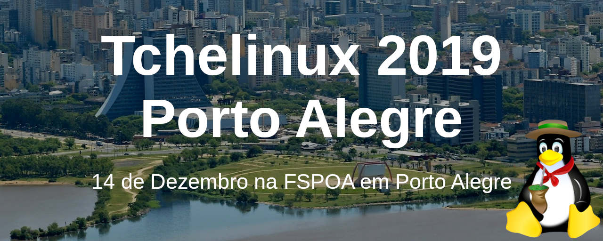

## Sobre

O grupo de usuários de Software Livre Tchelinux, em parceria com a [**Faculdade SENAC Porto Alegre**](http://senacrs.com.br/unidades.asp?unidade=63), tem o prazer de convidar a comunidade para participar do evento que ocorrerá no dia **12 de Dezembro de 2019 a partir das 8:00h** na FSPOA em Porto Alegre.

## Chamada de Trabalhos

A Chamada de Trabalhos está aberta e o **prazo para submissão** de propostas de palestra é **12 de Outubro de 2019**. Os trabalhos escolhidos serão anúnciados no dia **14 de Outubro de 2019**.

[**Clique aqui e submeta sua palestra agora mesmo!**](https://poa.tchelinux.org/cfp/)

## Inscrições

As inscrições estarão abertas a partir do dia 14 de Outubro de 2019, quando a **programação do evento** for anunciada.

O evento tem **entrada franca**, porém os participantes são encorajados a doar 2kg de alimentos não perecíveis (exceto sal), que são doados a instituições de caridade da região.

Os alimentos são recebidos no momento do credenciamento.

## Certificados

Serão fornecidos certificados digitais para os participantes do evento, que confirmaram sua presença. Para obtê-los, você deverá utilizar o email fornecido na sua inscrição para o evento.

**Importante:** Não esqueça de confirmar sua presença no credenciamento.

## Local

> **Faculdade SENAC Porto Alegre**
> Rua Coronel Genuíno, 130 - Centro
> Porto Alegre, RS

  <iframe src="https://www.google.com/maps/embed?pb=!1m18!1m12!1m3!1d13816.22495260168!2d-51.226522!3d-30.035244400000007!2m3!1f0!2f0!3f0!3m2!1i1024!2i768!4f13.1!3m3!1m2!1s0x0%3A0x514b4935e97fbf4d!2sFaculdade+Senac+Porto+Alegre+(Campus+I)!5e0!3m2!1spt-BR!2sbr!4v1564428617839!5m2!1spt-BR!2sbr" width="600" height="480" frameborder="0" style="border:0" allowfullscreen></iframe>

## Apoio

### Institucional

### Divulgação

