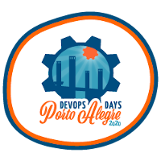

## Sobre

O grupo de usuários de Software Livre Tchelinux, em parceria com a [**Faculdade SENAC Porto Alegre**](http://senacrs.com.br/unidades.asp?unidade=63), tem o prazer de convidar a comunidade para participar do evento que ocorrerá no dia **14 de Dezembro de 2019 a partir das 8:00h** na FSPOA em Porto Alegre.

## Inscrições

O evento tem entrada franca, porém os participantes são encorajados a doar 2kg de alimentos não perecíveis (exceto sal), que são encaminhados ao Banco de Alimentos de Porto Alegre. Os alimentos serão recebidos no momento do credenciamento.

> **Importante** As inscrições pelo site foram encerradas, todavia é possível se inscrever no local do evento.
> 
> Caso você tenha interesse em participar, compareça na Faculdade SENAC Porto Alegre (Coronel Genuíno, 130 - Centro Histórico) no Sábado dia 14 de Dezembro a partir das 8:30 e faça sua inscrição no local.

## Certificados

Serão fornecidos certificados digitais para os participantes do evento, que confirmaram sua presença. Para obtê-los, você deverá utilizar o email fornecido na sua inscrição para o evento. Não esqueça de confirmar sua presença no credenciamento para que os certificados possam ser emitidos.

## Programação

| 
 Horário 
 | 
 Auditório 9º Andar   Cloud e Projetos   <small>(150 lugares)</small> 
 | 
 Sala 408   Kernel, IoT e Embarcados   <small>(30 lugares)</small> 
 | 
 Sala 409   Distribuições e Aplicativos   <small>(30 lugares)</small> 
 | 
 Sala 410   Comunidade e Carreira   <small>(30 lugares)</small> 
 | 
 Sala 412   Cases e Empreendedorismo   <small>(30 lugares)</small> 
 | 
 Sala 413   Segurança e Blockchain  <small>(50 lugares)</small> 
 | 
 Sala 502   DevOps e Sysadmin   <small>(30 lugares)</small> 
 | 
 Sala 503   Desenvolvimento Web  <small>(40 lugares)</small> 
 | 
 Sala 504   Python e Big Data  <small>(40 lugares)</small> 
 | 
 Sala 601   Golang, Lua e Rust   <small>(30 lugares)</small> 
 | 
 Sala 602   Desenvolvimento Mobile  <small>(30 lugares)</small> 
 |
|:--------------------------:|:-----------------------:|:-----------------------:|:-----------------------:|:-----------------------:|:-----------------------:|:-----------------------:|:-----------------------:|:-----------------------:|:-----------------------:|:-----------------------:|:-----------------------:|
| 08:30 <td colspan=12>
Credenciamento
 |
| 09:00 <td colspan=12>
Abertura  Auditório 9º Andar     Todo o público    Equipe Tchelinux   
 |
| 09:30 | [Como salvar a Internet - Ainda há tempo para a re-descentralização](palestras.md#Como_salvar_a_Internet_-_Ainda_há_tempo_para_a_re-descentralização)   Intermediário    Jaydson Gomes | [Uma introdução ao OpenALPR](palestras.md#Uma_introdução_ao_OpenALPR)   Principiante   Marco Mangan  | [Escrita acadêmica com o Latex](palestras.md#Escrita_acadêmica_com_o_Latex)    Principiante   Patrícia Kayser Vargas Mangan | [Como estruturar sua carreira e mostrar suas habilidades desde o 1º semestre da Graduação](palestras.md#Como_estruturar_sua_carreira_e_mostrar_suas_habilidades_desde_o_1º_semestre_da_Graduação)    Principiante   Rodrigo Rosa da Silva | [Consolidando Infraestrutura para implementação de Ubuntu como Desktop na PROCERGS](palestras.md#Consolidando_Infraestrutura_para_implementação_de_Ubuntu_como_Desktop_na_PROCERGS)    Principiante   Thiago Boeira | [Phishing. Por que ainda caímos nesse golpe?](palestras.md#Phishing._Por_que_ainda_caímos_nesse_golpe?)    Principiante   Élvis da Silva Steinbach | [Don't Repeat Yourself - Abstraindo funcionalidades com Jenkins Shared Libraries](palestras.md#Don't_Repeat_Yourself_-_Abstraindo_funcionalidades_com_Jenkins_Shared_Libraries)    Intermediário   Robson Luiz Valim de Bittencourt | [Testes unitários e de integração com React](palestras.md#Testes_unitários_e_de_integração_com_React)    Intermediário   Dennis Kaffer | [Uma Não-Gentil Introdução ao Stream Processing](palestras.md#Uma_Não-Gentil_Introdução_ao_Stream_Processing)    Intermediário   Julio Biason | [Golang: a sua nova linguagem de programação favorita](palestras.md#Golang:_a_sua_nova_linguagem_de_programação_favorita)    Principiante   Ricardo Robaina | [Nativo, híbrido ou PWA?  O que escolher para seu app?](palestras.md#Nativo,_híbrido_ou_PWA?_O_que_escolher_para_seu_app?)    Principiante   Jefferson Cardoso |
| 10:20 | [Porque e Como Participar de Projetos Open Source](palestras.md#Porque_e_Como_Participar_de_Projetos_Open_Source)   Principiante   Julio Biason | [Diversão com Perf, Ftrace e Bpftrace](palestras.md#Diversão_com_Perf,_Ftrace_e_Bpftrace)   Intermediário   Luis Claudio Gonçalves  | [Introdução a linha de comando e automação em Shell Script](palestras.md#Introdução_a_linha_de_comando_e_automação_em_Shell_Script)    Principiante   Mateus Gabriel Müller | [Conhecendo seus usuários com Matomo](palestras.md#Conhecendo_seus_usuários_com_Matomo)    Intermediário   Sidney Souza | [A jornada para o DevOps no âmbito militar: Lições aprendidas para uma automação bem sucedida](palestras.md#A_jornada_para_o_DevOps_no_âmbito_militar:_Lições_aprendidas_para_uma_automação_bem_sucedida)    Principiante   Thiago Finardi | [Configure seu primeiro servidor VPS na nuvem](palestras.md#Configure_seu_primeiro_servidor_VPS_na_nuvem)    Intermediário   William Brendaw | [Testes automatizados para servidores aarch64 em um Datacenter](palestras.md#Testes_automatizados_para_servidores_aarch64_em_um_Datacenter)    Intermediário   Patrícia Domingues | [Introdução ao Vue.js](palestras.md#Introdução_ao_Vue.js)   Principiante   João Pedro Sabbado Pereira | [Por que a galinha atravessou a rua?](palestras.md#Por_que_a_galinha_atravessou_a_rua?)    Principiante   Alan Mussoi | [Desmistificando o compilador Go: a jornada do func main() até o go run](palestras.md#Desmistificando_o_compilador_Go:_a_jornada_do_func_main%28%29_até_o_go_run)    Intermediário   Alex Garzão | [Migrando do complexo Java para o simplificado Kotlin](palestras.md#Migrando_do_complexo_Java_para_o_simplificado_Kotlin)    Principiante   Filipe Nunes |
| 11:10 | [Retrospectiva do Tchelinux 2019](palestras.md#Retrospectiva_do_Tchelinux_2019)   Principiante   Equipe Tchelinux | [Mecanismos anti-exploit no Kernel Linux](palestras.md#Mecanismos_anti-exploit_no_Kernel_Linux)   Intermediário   Roner de Castro Rodrigues  | [Introdução ao NixOS](palestras.md#Introdução_ao_NixOS)    Principiante   Victor Hugo Aguiar Pacce | [...porque no MEU TEMPO: um comparativo dos dias atuais com 10+ anos atrás](palestras.md#...porque_no_MEU_TEMPO:_um_comparativo_dos_dias_atuais_com_10+_anos_atrás)    Principiante   Fábio Beneditto |  [A importância da arquitetura de infraestrutura](palestras.md#A_importância_da_arquitetura_de_infraestrutura)    Intermediário   Marcelo Veriato Lima | [Detectando e Respondendo Incidentes de Segurança em Frontends Nginx Utilizando ELK](palestras.md#Detectando_e_Respondendo_Incidentes_de_Segurança_em_Frontends_Nginx_Utilizando_ELK)    Avançado   Jerônimo Zucco | [Container-Broker - Orquestrador de containers docker escrito em Ruby on Rails](palestras.md#Container-Broker_-_Orquestrador_de_containers_docker_escrito_em_Ruby_on_Rails)    Intermediário   João Carlos Vieira | [PHP SSO no Zentyal](palestras.md#PHP_SSO_no_Zentyal)    Intermediário   Jackson Ferreira de Andrade Mafra | [Uma API Responsa](palestras.md#Uma_API_Responsa)    Intermediário   Rafael Jeffman | [Primeiros passos com a Linguagem Lua](palestras.md#Primeiros_passos_com_a_Linguagem_Lua)    Principiante   João Avelino Bellomo Filho | [Coroutines vs RX](palestras.md#Coroutines_vs_RX)    Intermediário   Filipe Nunes |
| 12:00 <td colspan=12>
Intervalo para Almoço
 |
| 13:30 | [Construa sua Cloud do zero com Open Source!](palestras.md#Construa_sua_Cloud_do_zero_com_Open_Source!)   Principiante   Marcos Sungaila | [O que fazer (e o que não fazer) em desenvolvimento de sistemas embarcados](palestras.md#O_que_fazer_%28e_o_que_não_fazer%29_em_desenvolvimento_de_sistemas_embarcados)   Principiante    Otavio Salvador |  [Entendendo o Systemd](palestras.md#Entendendo_o_Systemd)    Intermediário   João Avelino Bellomo Filho | [Considerações sobre 20 anos de experiência com Linux (software e hardware)](palestras.md#Considerações_sobre_20_anos_de_experiência_com_Linux_%28software_e_hardware%29)    Principiante   Rudá Moura | [Riscos e falhas](palestras.md#Riscos_e_falhas)    Principiante   Marco Antonio Martins Junior (somatório) | [Programação Solidity para Contratos Inteligentes](palestras.md#Programação_Solidity_para_Contratos_Inteligentes)    Intermediário   Rodrigo Rosa da Silva | [Automação Ansible, do CLI para uma solução mais Enterprise](palestras.md#Automação_Ansible,_do_CLI_para_uma_solução_mais_Enterprise)   Principiante   Deivid Pilla | [Qualidade Essencial para Projetos PHP](palestras.md#Qualidade_Essencial_para_Projetos_PHP)    Principiante   Er Galvão Abbott | [Desenvolvendo Jogos com PyGame](palestras.md#Desenvolvendo_Jogos_com_PyGame)    Principiante   Jerônimo Madruga | [Estendendo o NGINX com Lua](palestras.md#Estendendo_o_NGINX_com_Lua)    Intermediário   Vinicius "Locão" Mignot | [Flutter Live Code - Criando um app lindo em 45 minutos](palestras.md#Flutter_Live_Code_-_Criando_um_app_lindo_em_45_minutos)    Intermediário   João Rutkoski |
| 14:20 | [Unix, o brotinho cinquentão](palestras.md#Unix,_o_brotinho_cinquentão)   Principiante   Carlos Santos |  [O que é essencial na atualização de firmware OTA e por que UpdateHub?](palestras.md#O_que_é_essencial_na_atualização_de_firmware_OTA_e_por_que UpdateHub?)   Intermediário    Diandra Martini | [Bash do Dia a Dia](palestras.md#Bash_do_Dia_a_Dia)    Principiante   Wanderson Henrique Camargo Rosa | [Tudo que você queria saber sobre a LGPD e não sabia pra quem perguntar!](palestras.md#Tudo_que_você_queria_saber_sobre_a_LGPD_e_não_sabia_pra_quem_perguntar!)    Intermediário   Marcos Lucas | [Dicas e Ferramentas para montar seu primeiro modelo de negócios.](palestras.md#Dicas_e_Ferramentas_para_montar_seu_primeiro_modelo_de_negócios.)    Principiante   Cláudia Sungaila | [Insegurança na Internet](palestras.md#Insegurança_na_Internet)    Intermediário   Diego Luiz Silva da Costa | [Utilizando o Rocket Chat em container](palestras.md#Utilizando_o_Rocket_Chat_em_container)    Intermediário   Fabricio Machado | [Integração Contínua em Projetos PHP Utilizando Github Actions](palestras.md#Integração_Contínua_em_Projetos_PHP_Utilizando_Github_Actions)    Intermediário   Igor Santos | [Flask and you](palestras.md#Flask_and_you)    Intermediário   Luciano Camargo Cruz | [Enferrujando a Web](palestras.md#Enferrujando_a_Web)    Intermediário   Michel Martinez | [Banco de Dados no Mobile: Do JavaME ao Flutter.](palestras.md#Banco_de_Dados_no_Mobile:_Do__JavaME_ao_Flutter)    Intermediário   Ricardo Ogliari |
| 15:10 | [Os bastidores da criação do htop](palestras.md#Os_bastidores_da_criação_do_htop)   Principiante   Hisham Muhammad | [ShellHub: Acessando seu dispositivo Linux de qualquer lugar do mundo](palestras.md#ShellHub:_Acessando_seu_dispositivo_Linux_de_qualquer_lugar_do_mundo)   Intermediario   Otávio Salvador | [Introdução a agilidade e Scrum](palestras.md#Introdução_a_agilidade_e_Scrum)    Principiante   Marcus Vinicius Brum da Costa | [Como matar a hydra da programação](palestras.md#Como_matar_a_hydra_da_programação)    Principiante   Perceu Bertoletti | [TI Verde para nós Nerds!](palestras.md#TI_Verde_para_nós_Nerds!)    Principiante   Luiz Rauber Rodrigues | [Shell Script para Pentesters - Ethical Hacker](palestras.md#Shell_Script_para_Pentesters_-_Ethical_Hacker)    Intermediário   Mateus Buogo | [Prometheus 101](palestras.md#Prometheus_101)    Principiante   Sebastian Webber | [Modern PHP](palestras.md#Modern_PHP)   Principiante   Igor Santos | [Python para Análise de Dados](palestras.md#Python_para_Análise_de_Dados)    Principiante   Andrius Jaques | [Rust para Linux Embarcados](palestras.md#Rust_para_Linux_Embarcados)    Intermediário   Jonathas Augusto de Oliveira Conceição | [Flutter e Hasura](palestras.md#Flutter_e_Hasura)    Intermediário   Vilson Dauinheimer |
| 16:00 <td colspan=12>
Coffee-Break
 |
| 16:30 <td colspan=12>
Encerramento  Auditório 9º Andar    Todo o público   Equipe Tchelinux   
 |

## Local

> **Faculdade SENAC Porto Alegre**
> Rua Coronel Genuíno, 130 - Centro
> Porto Alegre, RS

  <iframe src="https://www.google.com/maps/embed?pb=!1m18!1m12!1m3!1d13816.22495260168!2d-51.226522!3d-30.035244400000007!2m3!1f0!2f0!3f0!3m2!1i1024!2i768!4f13.1!3m3!1m2!1s0x0%3A0x514b4935e97fbf4d!2sFaculdade+Senac+Porto+Alegre+(Campus+I)!5e0!3m2!1spt-BR!2sbr!4v1564428617839!5m2!1spt-BR!2sbr" width="600" height="480" frameborder="0" style="border:0" allowfullscreen></iframe>

## Apoio

### Institucional

### Patrocínio

### Divulgação

