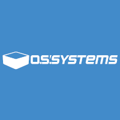
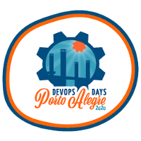
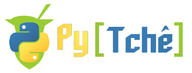

## Sobre

O grupo de usuários de Software Livre Tchelinux, em parceria com a [**Faculdade SENAC Porto Alegre**](http://senacrs.com.br/unidades.asp?unidade=63), tem o prazer de convidar a comunidade para participar do evento que ocorrerá no dia **14 de Dezembro de 2019 a partir das 8:00h** na FSPOA em Porto Alegre.

## Inscrições

O evento tem entrada franca, porém os participantes são encorajados a doar 2kg de alimentos não perecíveis (exceto sal), que são encaminhados ao Banco de Alimentos de Porto Alegre. Os alimentos serão recebidos no momento do credenciamento.

> **Importante** As inscrições pelo site foram encerradas, todavia é possível se inscrever no local do evento.
> 
> Caso você tenha interesse em participar, compareça na Faculdade SENAC Porto Alegre (Coronel Genuíno, 130 - Centro Histórico) no Sábado dia 14 de Dezembro a partir das 8:30 e faça sua inscrição no local.

## Certificados

Serão fornecidos certificados digitais para os participantes do evento, que confirmaram sua presença. Para obtê-los, você deverá utilizar o email fornecido na sua inscrição para o evento. Não esqueça de confirmar sua presença no credenciamento para que os certificados possam ser emitidos.

## Programação

| 
 Horário 
 | 
 Auditório 9º Andar   Cloud e Projetos   <small>(150 lugares)</small> 
 | 
 Sala 408   Kernel, IoT e Embarcados   <small>(30 lugares)</small> 
 | 
 Sala 409   Distribuições e Aplicativos   <small>(30 lugares)</small> 
 | 
 Sala 410   Comunidade e Carreira   <small>(30 lugares)</small> 
 | 
 Sala 412   Cases e Empreendedorismo   <small>(30 lugares)</small> 
 | 
 Sala 413   Segurança e Blockchain  <small>(50 lugares)</small> 
 | 
 Sala 502   DevOps e Sysadmin   <small>(30 lugares)</small> 
 | 
 Sala 503   Desenvolvimento Web  <small>(40 lugares)</small> 
 | 
 Sala 504   Python e Big Data  <small>(40 lugares)</small> 
 | 
 Sala 601   Golang, Lua e Rust   <small>(30 lugares)</small> 
 | 
 Sala 602   Desenvolvimento Mobile  <small>(30 lugares)</small> 
 |
|:--------------------------:|:-----------------------:|:-----------------------:|:-----------------------:|:-----------------------:|:-----------------------:|:-----------------------:|:-----------------------:|:-----------------------:|:-----------------------:|:-----------------------:|:-----------------------:|
| 08:30 <td colspan=12>
Credenciamento
 |
| 09:00 <td colspan=12>
Abertura  Auditório 9º Andar     Todo o público    Equipe Tchelinux   
 |
| 09:30 | [Como salvar a Internet - Ainda há tempo para a re-descentralização](palestras.md#Como_salvar_a_Internet_-_Ainda_há_tempo_para_a_re-descentralização)   Intermediário    Jaydson Gomes | [Uma introdução ao OpenALPR](palestras.md#Uma_introdução_ao_OpenALPR)   Principiante   Marco Mangan  | [Escrita acadêmica com o Latex](palestras.md#Escrita_acadêmica_com_o_Latex)    Principiante   Patrícia Kayser Vargas Mangan | [Como estruturar sua carreira e mostrar suas habilidades desde o 1º semestre da Graduação](palestras.md#Como_estruturar_sua_carreira_e_mostrar_suas_habilidades_desde_o_1º_semestre_da_Graduação)    Principiante   Rodrigo Rosa da Silva | [Consolidando Infraestrutura para implementação de Ubuntu como Desktop na PROCERGS](palestras.md#Consolidando_Infraestrutura_para_implementação_de_Ubuntu_como_Desktop_na_PROCERGS)    Principiante   Thiago Boeira | [Phishing. Por que ainda caímos nesse golpe?](palestras.md#Phishing._Por_que_ainda_caímos_nesse_golpe?)    Principiante   Élvis da Silva Steinbach | [Don't Repeat Yourself - Abstraindo funcionalidades com Jenkins Shared Libraries](palestras.md#Don't_Repeat_Yourself_-_Abstraindo_funcionalidades_com_Jenkins_Shared_Libraries)    Intermediário   Robson Luiz Valim de Bittencourt | [Testes unitários e de integração com React](palestras.md#Testes_unitários_e_de_integração_com_React)    Intermediário   Dennis Kaffer | [Uma Não-Gentil Introdução ao Stream Processing](palestras.md#Uma_Não-Gentil_Introdução_ao_Stream_Processing)    Intermediário   Julio Biason | [Golang: a sua nova linguagem de programação favorita](palestras.md#Golang:_a_sua_nova_linguagem_de_programação_favorita)    Principiante   Ricardo Robaina | [Nativo, híbrido ou PWA?  O que escolher para seu app?](palestras.md#Nativo,_híbrido_ou_PWA?_O_que_escolher_para_seu_app?)    Principiante   Jefferson Cardoso |
| 10:20 | [Porque e Como Participar de Projetos Open Source](palestras.md#Porque_e_Como_Participar_de_Projetos_Open_Source)   Principiante   Julio Biason | [Diversão com Perf, Ftrace e Bpftrace](palestras.md#Diversão_com_Perf,_Ftrace_e_Bpftrace)   Intermediário   Luis Claudio Gonçalves  | [Introdução a linha de comando e automação em Shell Script](palestras.md#Introdução_a_linha_de_comando_e_automação_em_Shell_Script)    Principiante   Mateus Gabriel Müller | [Conhecendo seus usuários com Matomo](palestras.md#Conhecendo_seus_usuários_com_Matomo)    Intermediário   Sidney Souza | [A jornada para o DevOps no âmbito militar: Lições aprendidas para uma automação bem sucedida](palestras.md#A_jornada_para_o_DevOps_no_âmbito_militar:_Lições_aprendidas_para_uma_automação_bem_sucedida)    Principiante   Thiago Finardi | [Configure seu primeiro servidor VPS na nuvem](palestras.md#Configure_seu_primeiro_servidor_VPS_na_nuvem)    Intermediário   William Brendaw | [Testes automatizados para servidores aarch64 em um Datacenter](palestras.md#Testes_automatizados_para_servidores_aarch64_em_um_Datacenter)    Intermediário   Patrícia Domingues | [Introdução ao Vue.js](palestras.md#Introdução_ao_Vue.js)   Principiante   João Pedro Sabbado Pereira | [Por que a galinha atravessou a rua?](palestras.md#Por_que_a_galinha_atravessou_a_rua?)    Principiante   Alan Mussoi | [Desmistificando o compilador Go: a jornada do func main() até o go run](palestras.md#Desmistificando_o_compilador_Go:_a_jornada_do_func_main%28%29_até_o_go_run)    Intermediário   Alex Garzão | [Migrando do complexo Java para o simplificado Kotlin](palestras.md#Migrando_do_complexo_Java_para_o_simplificado_Kotlin)    Principiante   Filipe Nunes |
| 11:10 | [Retrospectiva do Tchelinux 2019](palestras.md#Retrospectiva_do_Tchelinux_2019)   Principiante   Equipe Tchelinux | [Mecanismos anti-exploit no Kernel Linux](palestras.md#Mecanismos_anti-exploit_no_Kernel_Linux)   Intermediário   Roner de Castro Rodrigues  | [Introdução ao NixOS](palestras.md#Introdução_ao_NixOS)    Principiante   Victor Hugo Aguiar Pacce | [...porque no MEU TEMPO: um comparativo dos dias atuais com 10+ anos atrás](palestras.md#...porque_no_MEU_TEMPO:_um_comparativo_dos_dias_atuais_com_10+_anos_atrás)    Principiante   Fábio Beneditto |  [A importância da arquitetura de infraestrutura](palestras.md#A_importância_da_arquitetura_de_infraestrutura)    Intermediário   Marcelo Veriato Lima | [Detectando e Respondendo Incidentes de Segurança em Frontends Nginx Utilizando ELK](palestras.md#Detectando_e_Respondendo_Incidentes_de_Segurança_em_Frontends_Nginx_Utilizando_ELK)    Avançado   Jerônimo Zucco | [Container-Broker - Orquestrador de containers docker escrito em Ruby on Rails](palestras.md#Container-Broker_-_Orquestrador_de_containers_docker_escrito_em_Ruby_on_Rails)    Intermediário   João Carlos Vieira | [PHP SSO no Zentyal](palestras.md#PHP_SSO_no_Zentyal)    Intermediário   Jackson Ferreira de Andrade Mafra | [Uma API Responsa](palestras.md#Uma_API_Responsa)    Intermediário   Rafael Jeffman | [Primeiros passos com a Linguagem Lua](palestras.md#Primeiros_passos_com_a_Linguagem_Lua)    Principiante   João Avelino Bellomo Filho | [Coroutines vs RX](palestras.md#Coroutines_vs_RX)    Intermediário   Filipe Nunes |
| 12:00 <td colspan=12>
Intervalo para Almoço
 |
| 13:30 | [Construa sua Cloud do zero com Open Source!](palestras.md#Construa_sua_Cloud_do_zero_com_Open_Source!)   Principiante   Marcos Sungaila | [O que fazer (e o que não fazer) em desenvolvimento de sistemas embarcados](palestras.md#O_que_fazer_%28e_o_que_não_fazer%29_em_desenvolvimento_de_sistemas_embarcados)   Principiante    Otavio Salvador |  [Entendendo o Systemd](palestras.md#Entendendo_o_Systemd)    Intermediário   João Avelino Bellomo Filho | [Considerações sobre 20 anos de experiência com Linux (software e hardware)](palestras.md#Considerações_sobre_20_anos_de_experiência_com_Linux_%28software_e_hardware%29)    Principiante   Rudá Moura | [Riscos e falhas](palestras.md#Riscos_e_falhas)    Principiante   Marco Antonio Martins Junior (somatório) | [Programação Solidity para Contratos Inteligentes](palestras.md#Programação_Solidity_para_Contratos_Inteligentes)    Intermediário   Rodrigo Rosa da Silva | [Automação Ansible, do CLI para uma solução mais Enterprise](palestras.md#Automação_Ansible,_do_CLI_para_uma_solução_mais_Enterprise)   Principiante   Deivid Pilla | [Qualidade Essencial para Projetos PHP](palestras.md#Qualidade_Essencial_para_Projetos_PHP)    Principiante   Er Galvão Abbott | [Desenvolvendo Jogos com PyGame](palestras.md#Desenvolvendo_Jogos_com_PyGame)    Principiante   Jerônimo Madruga | [Estendendo o NGINX com Lua](palestras.md#Estendendo_o_NGINX_com_Lua)    Intermediário   Vinicius "Locão" Mignot | [Flutter Live Code - Criando um app lindo em 45 minutos](palestras.md#Flutter_Live_Code_-_Criando_um_app_lindo_em_45_minutos)    Intermediário   João Rutkoski |
| 14:20 | [Unix, o brotinho cinquentão](palestras.md#Unix,_o_brotinho_cinquentão)   Principiante   Carlos Santos |  [O que é essencial na atualização de firmware OTA e por que UpdateHub?](palestras.md#O_que_é_essencial_na_atualização_de_firmware_OTA_e_por_que UpdateHub?)   Intermediário    Diandra Martini | [Bash do Dia a Dia](palestras.md#Bash_do_Dia_a_Dia)    Principiante   Wanderson Henrique Camargo Rosa | [Tudo que você queria saber sobre a LGPD e não sabia pra quem perguntar!](palestras.md#Tudo_que_você_queria_saber_sobre_a_LGPD_e_não_sabia_pra_quem_perguntar!)    Intermediário   Marcos Lucas | [Dicas e Ferramentas para montar seu primeiro modelo de negócios.](palestras.md#Dicas_e_Ferramentas_para_montar_seu_primeiro_modelo_de_negócios.)    Principiante   Cláudia Sungaila | [Insegurança na Internet](palestras.md#Insegurança_na_Internet)    Intermediário   Diego Luiz Silva da Costa | [Utilizando o Rocket Chat em container](palestras.md#Utilizando_o_Rocket_Chat_em_container)    Intermediário   Fabricio Machado | [Integração Contínua em Projetos PHP Utilizando Github Actions](palestras.md#Integração_Contínua_em_Projetos_PHP_Utilizando_Github_Actions)    Intermediário   Igor Santos | [Flask and you](palestras.md#Flask_and_you)    Intermediário   Luciano Camargo Cruz | [Enferrujando a Web](palestras.md#Enferrujando_a_Web)    Intermediário   Michel Martinez | [Banco de Dados no Mobile: Do JavaME ao Flutter.](palestras.md#Banco_de_Dados_no_Mobile:_Do__JavaME_ao_Flutter)    Intermediário   Ricardo Ogliari |
| 15:10 | [Os bastidores da criação do htop](palestras.md#Os_bastidores_da_criação_do_htop)   Principiante   Hisham Muhammad | [ShellHub: Acessando seu dispositivo Linux de qualquer lugar do mundo](palestras.md#ShellHub:_Acessando_seu_dispositivo_Linux_de_qualquer_lugar_do_mundo)   Intermediario   Otávio Salvador | [Introdução a agilidade e Scrum](palestras.md#Introdução_a_agilidade_e_Scrum)    Principiante   Marcus Vinicius Brum da Costa | [Como matar a hydra da programação](palestras.md#Como_matar_a_hydra_da_programação)    Principiante   Perceu Bertoletti | [TI Verde para nós Nerds!](palestras.md#TI_Verde_para_nós_Nerds!)    Principiante   Luiz Rauber Rodrigues | [Shell Script para Pentesters - Ethical Hacker](palestras.md#Shell_Script_para_Pentesters_-_Ethical_Hacker)    Intermediário   Mateus Buogo | [Prometheus 101](palestras.md#Prometheus_101)    Principiante   Sebastian Webber | [Banco de Dados Livre: Elaborando soluções de qualidade para o seu projeto!](palestras.md#Banco_de_Dados_Livre:_Elaborando_soluções_de_qualidade_para_o_seu_projeto!)    Principiante   Willian Barreto Froes | [Python para Análise de Dados](palestras.md#Python_para_Análise_de_Dados)    Principiante   Andrius Jaques | [Rust para Linux Embarcados](palestras.md#Rust_para_Linux_Embarcados)    Intermediário   Jonathas Augusto de Oliveira Conceição | [Flutter e Hasura](palestras.md#Flutter_e_Hasura)    Intermediário   Vilson Dauinheimer |
| 16:00 <td colspan=12>
Coffee-Break
 |
| 16:30 <td colspan=12>
Encerramento  Auditório 9º Andar    Todo o público   Equipe Tchelinux   
 |

## Palestras 

### Como salvar a Internet - Ainda há tempo para a re-descentralização

O poder criativo e destrutivo do ser humano é incrível. Seja inconscientemente causando a extinção de mamutes na Eurásia, ou conscientemente acabando com tribos nativas em favor da colonização, nossa maior virtude às vezes nos coloca em xeque-mate. Nos anos 60 criamos uma das maiores ferramentas da história da humanidade: A Internet. Entretanto, estamos conseguindo destruí-la antes mesmo de explorar todo seu potencial e impacto positivo na evolução da sociedade e da própria humanidade.

### Jaydson Gomes

[**Jaydson Gomes**](https://jaydson.com) trabalha com tecnologia desde o início dos anos 2000 e é​ desenvolvedor de software especializado em JavaScript. ​É sócio fundador da Nasc e da ​BrazilJS e curador/idealizador da ​BrazilJS Conf, uma das maiores conferências do mundo sobre a linguagem JavaScript. É editor da Newsletter BrazilJS Weekly e host do show BrazilJS Weekly no YouTube. Jaydson também é autor e editor no portal BrazilJS e escreve em seu blog pessoal. É um entusiasta open source e tem apresentado diversas palestras ao longo dos últimos anos, em sua grande maioria falando sobre JavaScript e tecnologias Web.

### Porque e Como Participar de Projetos Open Source

No mundo atual, todos usam pelo menos um aplicativo open source. Mas como participar disso? Como ajudar o aplicativo a melhorar? É preciso saber programar para ajudar? Essas e outras perguntas serão respondidas nessa apresentação.

### Julio Biason

[**Julio Biason**](https://functional.cafe/@juliobiason) participa de projetos open source desde 1990.

### Retrospectiva do Tchelinux 2019

Uma breve retrospectiva dos 15 eventos realizados pelo Tchelinux entre os meses de Março e Dezembro de 2019. Conheça os bastidores da organização, as pessoas que fizeram tudo isso possível e principalmente os resultados do trabalho de centenas de voluntários na tarefa de levar o Software Livre a todas regiões do Rio Grande do Sul!

### Equipe Tchelinux

A paixão pelo Software Livre assim como o desejo de compartilhar conhecimentos fez com que um grupo de usuários se reunisse e trabalhasse junto na organização de eventos para a divulgação de ferramentas e da filosofia open source em instituições educacionais do Rio Grande do Sul. Desde Outubro de 2006 o Tchelinux realizou 102 eventos em 22 cidades com o auxílio de milhares de voluntários, que ajudaram na organização e apresentando 1592 palestras foram assistidas por 12579 pessoas que doaram 18260kg de alimentos para 54 instituições de caridade. 

### Construa sua Cloud do zero com Open Source!

Como construir um ambiente de Cloud Computing do zero usando apenas software open source. Do hypervisor ao orquestrador de containers, do SDN até o SDS passando por vários componentes e projetos.

### Marcos Sungaila

[**Marcos Sungaila**](https://br.linkedin.com/in/marcossungaila) é Master Principal Sales Consultant na Oracle, Consultor e Arquiteto de Soluções OpenSource atuando nas áreas de infraestrutura de redes, cloud computing e segurança da informação, realizou inúmeras implantações Linux e Cloud Computing no meio corporativo. Projetos de integração de redes heterogêneas, auditoria e performance de servidores. Em 2018 no OpenStack Summit em Vancouver foi premiado como “Mentor of Mentors”. É autor do livro "Autenticação Centralizada com OpenLDAP". Arquiteto pelo Mackenzie -1995. Pós Graduação Engenharia de Redes pela FASP - 2001. Certificado Mirantis Cloud Platform, RHCA - Level 4, OpenStack-RHCSA-OSP, RHCE, RHCDS, RHCVA, RHCSA; LPI – Level I e II, Mandriva-Pro, SUSE CLA. Ministrou aulas na FIAP, Red Hat Brasil, Green, Infnet, DBA, HP, Universidade Católica de Brasília, PUC-SP, FESP/PR, FAINAM, BANDTEC e "in company" para várias empresas. Palestrante convidado nos eventos: Meetup – Savant (4) 2019; Inovabra - Bradesco 2019; Congresso de Tecnologia – PUC/GO 2019; TDC - Recife, São Paulo, Florianópolis 2019; Campus Party 2019, 2016; Oracle OpenWorld – SP 2018; CephDay SP 2018, 2017; OpenStackDay SP 2018, 2017, 2016; FLISOL – Santo André 2018; TDC - Florianópolis, São Paulo e Porto Alegre 2018; Latinoware 2018, 2017, 2016, 2015, 2014; Fedora 24 Release Party; Fórum de Software Livre - Faculdade Impacta – 2015; FAD 2013; Wecti-Unicid 2012/2010; Fatec-Jundiaí 2010; Tchelinux/RS 2009; Software Freedom Day/PR 2009; Eri-Co/DF 2008; Conisli/SP 2008. Ministrou treinamentos Linux para mais de 18.000 alunos.

### Unix, o brotinho cinquentão

O ano de 2019 marca os 50 anos do lançamento do artigo “The Evolution of the Unix Time-sharing System”, no qual Dennis M. Ritchie descrevia os progressos do então recente sistema operacional. Criado nos porôes do Bell Labs entre o final dos anos 1960 e o início dos anos 1970, Unix se tornaria dos softwares mais influentes de todos os tempos. Nesta apresentação contaremos um pouco dessa história e discutiremos o futuro do Unix e de seus derivados.

### Carlos Santos

[**Carlos Santos**](https://www.linkedin.com/in/unixmania/) é Engenheiro agrícola, acredite quem quiser (UFPel, 1988), Pesquisador bolsista (EMBRAPA, 1989-1993), Programador e gerente de redes (CPMet/UFPel, provedores de serviços Internet, 1993-1999), Mestre em Ciência da Computação, na área de Computação Gráfica (UFRGS, 1998-2000), Professor de CG, programação e redes (URI, Santo Ângelo, 2001-2005), Engenheiro de software (HP, 2005-2013), Engenheiro de manutenção de software (Red Hat, 2013-2014), Arquiteto de software (DATACOM, 2014-2019) e Engenheiro de manutenção de software, de novo (Red Hat, 2019-).

### Os bastidores da criação do htop

Nesta palestra veremos os bastidores da criação do gerenciador de processos [htop](https://hisham.hm/htop/) um projeto de software livre que começou de forma despretensiosa e se tornou uma ferramenta [bastante popular](https://hisham.hm/htop/index.php?page=sightings). Vamos ver o que é o htop, desmistificar o seu funcionamento, conversar sobre as decisões de design que possivelmente influenciaram na sua popularidade e contar alguns causos do seu desenvolvimento.

### Hisham Muhammad

[**Hisham Muhammad**](https://hisham.hm/about) possui Doutorado na área de Linguagens de Programação pela [PUC-Rio](http://www.puc-rio.br/) e trabalha como mantenedor do [LuaRocks](https://luarocks.org/), um gerenciador de pacotes para a [Linguagem Lua](https://www.lua.org/) para a [Kong](https://konghq.com/). Desenvolvedor de uma série de projetos de software livre escritos em diferentes linguagens, é o criador e mantenedor do gerenciador de processos [htop](https://hisham.hm/htop/) e co-fundador da distribuição [GoboLinux](http://gobolinux.org/).

### Uma introdução ao OpenALPR

A leitura automática de placas de veículos é uma aplicação de visão computacional na identificação do registro de um automóvel com o uso de câmeras. O recurso substitui o reconhecimento manual e o uso de dispositivos, como RFID, na segurança pública, estacionamentos, pedágios e controle de frota. O  Open Automatic License Plate Recognition  (OpenALPR) é um sistema escrito em C++, distribuído sob a  GNU Affero General Public License v3.0 , que pode ser utilizado a partir de aplicações em C\#, Java, Node.js e Python, incluindo aplicações móveis. Com o objetivo de incentivar e discutir seu uso, a palestra apresenta uma visão geral do reconhecimento de placas de veículo, do impacto na privacidade e das oportunidades de novas aplicações.

### Marco Aurélio Souza Mangan

[**Marco Aurélio Souza Mangan**](https://github.com/masmangan) é Graduado (1995) e Mestre (1998) em Ciência da Computação pelo Instituto de Informática/UFRGS e doutorado em Engenharia de Sistemas e Computação pelo PESC/UFRJ (2006). Atualmente é professor da Escola Politécnica/PUCRS. Os principais interesses são ensino, teoria e prática de desenvolvimento de software.

### Diversão com Perf, Ftrace e Bpftrace

Como utilizar de forma criativa algumas das principais ferramentas de depuração oferecidas pelo kernel do Linux para fins didáticos, profissionais ou sociais. Em outras palavras, como utilizar as ferramentas para aprender sobre o kernel, depurar e validar código ou simplesmente impressionar os amigos em festas.

### Luis Claudio Rodrigues Gonçalves

**Luis Claudio Rodrigues Gonçalves** é usuário de Linux desde 1994, curioso. Membro do Tchelinux desde os primórdios, apaixonado pela idéia do Software Livre. Trabalha na Red Hat como membro da equipe de Real Time.

### Mecanismos anti-exploit no Kernel Linux

O objetivo é demonstrar algumas das vulnerabilidades que podem ser encontradas tanto no kernel Linux quanto nas aplicações voltadas para esse sistema, bem como seus respectivos mecanismos de mitigação para os exploits relcionados.

### Roner de Castro Rodrigues

[**Roner de Castro Rodrigues**](https://github.com/Ansatsuken1337x/) é Graduando no curso de Engenharia de Computação na Unipampa Campus Bagé e trabalha atualmente como desenvolvedor Delphi com SQL.

### O que fazer (e o que não fazer) em desenvolvimento de sistemas embarcados

Com base na experiência e tempo dedicados ao desenvolvimento e customização de sistemas embarcados, nessa palestra, serão abordados casos de uso de sucesso (e fracasso) que levaram a empresa O.S. Systems a adotar algumas boas práticas no desenvolvimento de sistemas embarcados.

### Otavio Salvador

[**Otavio Salvador**](https://github.com/otavio) é empresário, escritor e entusiasta de Software Livre. Está envolvido com desenvolvimento de Linux Embarcado desde 2008 em diferentes indústrias.

### O que é essencial na atualização de firmware OTA e por que UpdateHub?

Atualizações de firmware OTA são críticas em diversos dispositivos. Nessa palestra iremos abordar o que deve ser levado em conta nesse processo, os principais desafios e quais as soluções disponíveis no mercado que oferecem as ferramentas mais adequadas para garantir atualizações Over-The-Air seguras e eficientes.

### Diandra Martini

[**Diandra Martini**](https://www.linkedin.com/in/diandramartini/) é Business Analyst na O.S. Systems, empresa especializada em Linux embarcado, onde atua na área comercial, de marketing e vendas. Tem formação em Relações Internacionais e Ciência Política pela UFPel, é entusiasta de IoT e grande admiradora da filosofia Open Source.

### ShellHub: Acessando seu dispositivo Linux de qualquer lugar do mundo

O ShellHub é uma plataforma open source desenvolvida para permitir o acesso remoto a dispositivos Linux, sem a necessidade de configurar uma VPN ou firewall. Fazendo uso da conectividade via internet é possível acessar o Shell do seu dispositivo de qualquer lugar do mundo, possibilitando assim o monitoramento, a visualização de logs, bem como a solução de problemas inspecionando o dispositivo, debugando problemas no sistema operacional e até mesmo prestando assistência remota quando necessário, pois a plataforma conta com canais criptografados e com uma infraestrutura extremamente segura.

### Otavio Salvador

[**Otavio Salvador**](https://github.com/otavio) é empresário, escritor e entusiasta de Software Livre. Está envolvido com desenvolvimento de Linux Embarcado desde 2008 em diferentes indústrias.

### Escrita acadêmica com o Latex

O objetivo da palestra é apresentar uma visão geral e o potencial do Latex para  a construção de textos técnicos e acadêmicos. Será apresentado  como a estrutura do Latex pode auxiliar na construção  de textos monográficos (trabalhos de conclusão, dissertações e teses) e textos técnico-científicos (artigos, relatórios e propostas de projetos). Também serão discutidas ferramentas para a  edição e gestão de documentos e referências bibliográficas. 

### Patrícia Kayser Vargas Mangan

[**Patrícia Kayser Vargas Mangan**](https://br.linkedin.com/in/patr%C3%ADcia-kayser-vargas-mangan-b12a7716) possui Graduação (1995) e Mestrado (1998) em Ciência da Computação pela UFRGS e Doutorado (2006) em Engenharia de Sistemas e Computação pela COPPE/Sistemas da UFRJ. É professora da UNILASALLE/Canoas-RS, vinculada ao Programa de Pós-Graduação em Memória Social e Bens Culturais pertencendo a linha de Memória e Linguagens Culturais e Diretora de Pesquisa e Pós-graduação Stricto Sensu.

### Introdução a linha de comando e automação em Shell Script

Tópicos desta apresentação:

1. Rapidamente falar dos motivos para aprender CLI.
2. Mostrar um pequeno desenho de como funciona a interação com o Shell (Usuário -> Terminal -> Shell).
3. Mostrar algumas coisas que podem ser feitas de forma mais "introvertida" (variáveis, pipe, contas, etc...)
4. Deixar claro como isso pode ser aplicado em Shell
5. Mostrar algumas pequenas boas práticas para um código em Shell
6. Mostrar em uma DEMO um código simples e como combinei o que foi mostrado no passo 3.
7. Concluir com as vantagens de aprender CLI e Shell.

### Mateus Gabriel Müller

[**Mateus Gabriel Müller**](https://www.linkedin.com/in/mateus-gabriel-m%C3%BCller-790709bb/) usa Linux desde 2014, trabalhou no time de suporte da Dell e hoje trabalha no suporte da SAP Labs em São Leopoldo.

### Introdução ao NixOS

NixOS é uma distribuição Linux que utiliza a aproximação inovadora de aplicar princípios da programação funcional para compor sistemas declarativos e imutáveis.

### Victor Hugo Aguiar Pacce

[**Victor Hugo Aguiar Pacce**](https://www.github.com/drakonis) atualmente um estudante de Ciência da Computação na Universidade de Santa Cruz do Sul.

### Entendendo o Systemd

O Systemd é o software hoje utilizado pela maioria das distribuições Linux para a inicialização do sistema. Ele apresenta uma infinidade de melhorias em relação aos sofwares anteriores e, ao mesmo, tempo apresenta uma série de novos desafios. Essa apresentação visa identificar os pontos chave dele, enfatizando a nova forma de visualizar o funcionamento da inicialização, bem como mostrar algumas das ferramentas complementares a ele.

### João Avelino Bellomo Filho

[**João Avelino Bellomo Filho**](https://www.linkedin.com/in/jo%C3%A3o-avelino-bellomo-filho-0b2229a/) é Tecnólogo em Processamento de Dados pela Universidade Católica de Pelotas, Mestre em Ciência da Computação pela Universidade Federal do Rio Grande do Sul. É usuário de Fedora Linux e atualmente é Desenvolvedor na Azion Technologies.

### Bash do Dia a Dia

Ao auxiliar os desenvolvedores na equipe onde trabalho, notei que muitos somente digitam os comandos "por digitar", não compreendendo o que realmente acontece por baixo dos panos. Assim, criei uma sequência de microaulas para explicar como o bash executa os comandos informados, melhorando a compreensão e possibilitando novas composições de comandos. Esta palestra utiliza a primeira microaula, com a seguinte agenda: apresentação, processos, argumentos, macros, descritores de arquivos e comandos básicos.

### Wanderson Henrique Camargo Rosa

[**Wanderson Henrique Camargo Rosa**](https://wandersonwhcr.github.io) é Programador PHP Especialista na Uhuu e há mais de 10 anos trabalha com diferentes tecnologias para o desenvolvimento Web.

### Introdução a agilidade e Scrum

Entenda alguns conceitos como: o que é ágil, raplexidade, a diferença entre time e equipe, a forma do trabalho de antigamente em comparação com a atua, lean mindset, manifesto ágil, modern Agile, Scrum, entre outros.

### Marcus Vinicius Brum da Costa

[**Marcus Vinicius Brum da Costa**](https://www.linkedin.com/in/marcusvbcosta/) tem 30 anos, é apaixonado por aprender, Agile Coach, SCRUM Master, Gerente de TI, Gerente de projetos e produtos, Arquiteto de software, Desenvolvedor e Empreendedor.

### Como estruturar sua carreira e mostrar suas habilidades desde o 1º semestre da Graduação

Uma das grandes aflições de muitos ingressantes no mercado de trabalho é como conseguir a sonhada incersão no meio. Muitos não sabem como elaborar um portifólio, como desmonstrar suas "skills" adquiridas durante a graduação ou mesmo no seu último trabalho formal/informal. Cabe ressaltar que manter-se constantemente atualizado, além de saber demostrar suas habilidades para o mercado de trabalho é essencial para ser um profissional competitivo, aliado a um networking nas áreas de interesse. Com as mudanças recentes no mundo da tecnologia, isso é mais verdadeiro do que nunca. O objetivo da palestra é mostrar aos interessados como preparar um portifólio com o uso ferramentas disponível à grande comunidade, como recrutadores, empresários, além de participar da comunidade de TI como um membro ativo, tudo desde o primeiro semestre de graduação, possibilidado uma rápida e valiosa experiência de crescimento pessoal e profissional.

### Rodrigo Rosa da Silva

[**Rodrigo Rosa da Silva**](https://www.linkedin.com/in/rodrigo-rosa-da-silva-472928138/) possui graduação em Matemática (Licenciatura Plena) pela Universidade da Região da Campanha (URCAMP) em 2009 e Tecnologia em Análise e Desenvolvimento de Sistemas pelo Instituto Federal de Educação, Ciência e Tecnologia Sul-riograndense (IFSul) em 2018. Especialista em Metodologia do Ensino de Matemática e Física pela Faculdade Internacional de Curitiba (UNINTER) concluído em 2012. Atuou no GSI - Grupo de Estudos em Segurança de Sistemas e da Informação na Universidade Federal do Pampa (UNIPAMPA) e também desenvolveu atividades de pesquisa junto à EMBRAPA Pecuária Sul. É colaborador oficial do projeto Portugol Studio, na produção de materiais de ensino. Atualmente é aluno nos cursos de Especialização em Desenvolvimento Orientado a Objetos em JAVA pela UNICIV. Tem interesse na área de aprendizagem de máquina, mineração de dados, redes neurais artificiais, algoritmos genéticos, ensino de programação, desenvolvimento android, API(REST/RESTFull). Trabalha na Prefeitura Municipal de Bagé, no setor de GeoInformação com informações geográficas e desenvolvimento de sistemas WEB e mobile.

### Conhecendo seus usuários com Matomo

O matomo é uma alternativa livre ao google analytics que prove informações preciosas a respeito do internauta que acessa seu site/blog/ferramenta possibilitando entender seu comportamento e tomar decisões baseando-se em dados e não mais em achismos.

### Sidney Souza

[**Sidney Souza**](https://github.com/lockland) é programador apaixonado por software livre, educação e natureza. Atualmente trabalha como programador na empresa Alright desenvolvendo tecnologia para conectar portais e anunciantes a fim de reduzir o custo do investimento com marketing digital para o anunciantes e aumentar o lucro dos portais que mostram essas propagandas.

### ...porque no MEU TEMPO: um comparativo dos dias atuais com 10+ anos atrás

Voltada para todos os tipos de público, é uma apresentação / comparação sobre as tecnologias atuais em relação às disponíveis há 10 ou 15 anos atrás. Distribuições de Software, configuração de hardware, programas, redes sociais: o quanto isso pode mudar em 15 anos? 

### Fabio Beneditto

[**Fabio Beneditto**](about.me/fabiobeneditto) é Desenvolvedor Web, egresso da Feevale, Old School Nerd, simpatizante de F/OSS, segurança da informação e comunidades em geral. Voluntário Tchelinux desde 2016, é praticante de #mototerapia.

### Considerações sobre 20 anos de experiência com Linux (software e hardware)

Considerações sobre 20 anos de experiência com Linux, sob um ponto de vista de mudanças de software e hardware (bem em geral, sem muito detalhes) e carreira profissional.

### Rudá Moura

[**Rudá Moura**](https://rudamoura.com) é um humano preocupado com o futuro da tecnologia.

### Tudo que você queria saber sobre a LGPD e não sabia pra quem perguntar!

A Lei Geral de Proteção de Dados é um conjunto de normas que tem visam proteger a privacidade das pessoas e estabelecer uma relação mais transparente entre companhias e clientes, principalmente no que tange ao uso de informações. Mas para entrar em compliance com a lei, todas as empresas terão de não só adequar seus sistemas de TI, bem como repensar a forma de tratamento e processamento de dados em todos os âmbitos, principalmente no que tange à segurança dos dados. Esta palestra tem como objetivo um debate de como isso afeta as organizações, não só falando das multas e penalizações previstas para quem não buscar conformidade, mas também discutindo as principais dúvidas júridicas do pessoal de tecnologia (e de tecnologia do pessoal das áreas jurídicas :).

### Marcos Lucas

[**Marcos Lucas**](https://twitter.com/MarcosLucas) é Professor Universitário nos cursos de Ciência da Computação (URI) e Análise e Desenvolvimento de Sistemas (FAE). Gestor da empresa DATAWARE, pela qual é responsável pela infraestrutura de tecnologia de rede, servidores e nuvem de diversas empresas da região do Alto Uruguai. Profissional certificado ASSESPRO-RS em DPO e LGPD, é também Pós-graduado em Redes de Computadores e Mestre em Computação Aplicada (UPF) trabalhando com soluções embarcadas aplicadas ao campo de Engenharia Biomédica. Entusiasta de software livre, trabalhando com este de maneira profissional há quase duas décadas, tendo já contribuído em eventos da área.

### Consolidando Infraestrutura para implementação de Ubuntu como Desktop na PROCERGS

Descrever o cenário, como após implementar o Ubuntu como desktop Linux na PROCERGS: Os desafios para criar e consolidar uma infraestrutura minima, visando garantir implementação continua do mesmo a nível de organização estatal.

### Thiago Boeira

[**Thiago Boeira**](https://www.facebook.com/tcboeira) é Técnico em Redes pela Escola Técnica Maxwell. Teve o primeiro contato com Linux em Junho de 1998, MAS conhecer mesmo só a partir de 2003. Um trabalho especifico em 2009 e um projeto em 2010. Trabalhar efetivamente a partir de 2016. Atualmente trabalha na PROCERGS - desde 05/2013 - na área de Infraestrutura. Antes, trabalhando com TI desde final dos anos 90, hoje com ampla atuação em plataformas Microsoft.

### A jornada para o DevOps no âmbito militar: Lições aprendidas para uma automação bem sucedida

Com a constante evolução da Infraestrutura tradicional se faz necessário não apenas a atualização dos ativos computacionais, mas também adotar novas metodologias que façam com que os recursos e serviços sejam provisionados, atualizados e entregues em menor tempo, permitindo escalabilidade e alta disponibilidade. Agora, imagine aplicar as práticas DevOps em uma infraestrutura tradicional em um ambiente Militar, onde encontramos dificuldades já conhecidas e esperadas, e novas barreiras, muitas delas, culturais, impostas pelo meio. Nesta apresentação serão abordados temas relativos a modernização dos processos tradicionais, Versionamento, Testes, Gerenciamento de configuração, Provisionador, Automação, Métricas e Monitoramento. Utilizando ferramentas como Git, Ansible, Docker, Grafana, Graylog, Zabbix, Prometheus, etc. E claro, um pouco da cultura DevOps, assim como os principais óbices encontrados e lições aprendidas nesta jornada sem fim.

### Thiago Finardi

[**Thiago Finardi**](https://www.linkedin.com/in/thiagofinardi/) possui Mestrando em Ciência da Computação, Especialista em Gestão de Segurança da Informação e Graduado em Sistemas de Informação. Profissional de TI com mais de 12 anos de experiência em infraestrutura computacional, GNU/Linux, segurança da informação, treinamento e suporte. Atualmente, executa o papel de Arquiteto de Soluções em Cloud Computing no Exército Brasileiro.

Dentre os principais conhecimentos pertinentes a área de atuação estão: Next Generation Firewalls (Cisco, Palo Alto e F5 Networks); Cloud Computing (Azure, AWS e GCP); Ferramentas DevOps; Big Data; Machine Learning; Infraestrutura hibrida e; Serviços Cognitivos.

Durante sua jornada na área de TI pode executar vários papéis, porém sempre com ênfase na administração de sistemas, como VMware vSphere, Xen Server, GNU/Linux (Debian e Red Hat) e Windows Server. Assim como os mais diversos serviços suportados por uma infraestrutura de TI.

### A importância da arquitetura de infraestrutura

Explanação sobre a importância da arquitetura de infraestrutura em ambientes corporativos, criando ambientes seguros, escaláveis e tolerantes a falhas. Abordaremos todas as camadas da infraestrutura, casos de uso e onde podemos empregar software livre em uma arquitetura de Data Center.

### Marcelo Veriato Lima

[**Marcelo Veriato Lima**](https://www.linkedin.com/in/marcelo-veriato/) é CTO da empresa Adentro, trabalha a bons anos com tecnologias de código aberto e infraestruturas complexas. Responsável pela implementação de diversas estruturas de cloud pelo Brasil e exterior.

### Dicas e Ferramentas para montar seu primeiro modelo de negócios.

Nesta apresentação serão vistas algumas ferramentas e dicas para ajudar a criar um modelo de negócios no modelo Startup.

### Cláudia Sungaila

[**Cláudia Sungaila**](https://www.linkedin.com/in/claudiasungaila/) é Co-Founder da SAVANT Tecnologia da Informação, Empreendedora, Advogada e Apaixonada por Educação e Soluções baseadas em Software Livre, Entusiasta do OpenStack, Linux, CEPH e soluções de Cloud Computing. Graduada em Direito pela USP. Especialização em Direito Eletrônico pelo IBMEC-SP. Formação Conectiva Linux em 2005. Capacitação: Empretec, Empreenda e Speed Mentoring Woman Tech e Edtech pelo Sebrae-SP. Palestrante convidada nos eventos: Sebrae-SP para Mulheres 2014; Apresentação do projeto TIC - Sebrae-SP 2017; Feira do Empreendedor 2018 - painel - Empresários de Sucesso; Flisol 2018 -  UFABC; Latinoware 2018; Semana de Tecnologia – ETEC - Embu das Artes 2018.

### Riscos e falhas

Todo projeto tem seus riscos, mas sabia que podemos reduzi-los sem parar de inovar? E quando esse risco acaba virando uma falha, que podemos transformar em oportunidade de aprendizado? É eu sei, parece papo de coach, mas é coisa séria! Nesta palestra falarei sobre duas práticas que já são utilizadas por empresas consideradas "high performers" (de novo esse papo de coach?) para tentar responder essas duas perguntas.

### Marco Antonio Martins Junior (somatório)

[**Marco Antonio Martins Junior (somatório)**](www.somatorio.org) é "Peão as a Service", entusiasta da cultura DevOps, organizador do DevOpsDays Porto Alegre, Docker community leader (Porto Alegre), fuçador convicto, roda praticamente tudo em containers.

### TI Verde para nós Nerds!

De uma forma potencialmente menos chata e inclusiva à ate quem não é de informática e aos nerds, pretende-se explanar tópicos ligados a TI Verde ou Green IT (e seus relacionados) como: obsolescência programada; lixo eletrônico (e-waste); ISO; ACV (Análise do Ciclo de Vida) e ACV-S; cidades inteligentes e ainda algumas sugestões de soluções tecnológicas (ou não) que podem fazer bem ao seu bolso e ao meio-ambiente, pensando-se nos 3 pilares da sustentabilidade (que é outro tópico da palestra).

### Luiz Rauber Rodrigues

[**Luiz Rauber Rodrigues**](https://www.linkedin.com/in/luizrauber) é Empreendedor/ Professor/ Pesquisador a anos ligado a grupos de Software Livre, Startups, Gestão de Projetos e Educação; Atualmente é doutorando em Tecnologia Ambiental com tese em TI Verde e ACV-S de Smartphones na UNISC e professor de informática no Senac Santa Cruz do Sul; Fez Mestrado em Nanociências (UNIFRA) onde trabalhou com genética, especialização em Gerenciamento de Projetos na PUCRS com métodos ágeis e graduação em Ciência da Computação e Técnico Informática na URI-Santiago com sistemas web. Voluntário ao ecossistemas de Startups e eventos da área como Startup Weekend em algumas cidades e grupos/ eventos de Software Livre como FISL, Latinoware, Campus Party, FLISOL, Tchelinux.org, Code Clube Brasil e JabutiEDU.org.

### Phishing. Por que ainda caímos nesse golpe?

A palestra apresentará a técnica phishing adotada por crackers e trará uma discussão sobre o que leva a cairmos nessa armadilha.

### Élvis da Silva Steinbach

[**Élvis da Silva Steinbach**](https://whitehatlinux.com) é formado em Análise e Desenvolvimento de Sistemas e Pós-graduado em Segurança da Informação. Trabalha atualmente como analista de sistemas e analista de SI. É autor do livro [White Hat Linux](https://whitehatlinux.com). 

### Configure seu primeiro servidor VPS na nuvem

Aprenda a configurar do zero um VPS (Virtual Private Server) seguro e totalmente customizável rodando um serviço Spring Boot com MariaDB na nuvem do Linode. Vamos utilizar muitos comandos no terminal como SSH, Vim, Keygen, Iptables e Fail2Ban, fazer um tunning no servidor e também criar um sistema de backup de dados.

### William Brendaw

[**William Brendaw**](https://www.williambrendaw.com) é desenvolvedor há 8 anos, mesmo tempo em que utiliza software livre. Tem interesse em boas práticas de design de código, automatização de processos com Shell Script, criação e configuração de ambientes de desenvolvimento e projetos com Arduino. Atualmente é Desenvolvedor de Microsserviços Java Sênior na Compasso UOL Diveo, responsável pela implementação de serviços para grandes projetos no varejo online do Brasil.

### Detectando e Respondendo Incidentes de Segurança em Frontends Nginx Utilizando ELK

Nessa apresentação serão demonstrados casos reais de detecção e resposta a incidentes através do monitoramento de logs de diversos frontends Nginx devidamente configurados utilizando a pilha ELK (Elasticsearch, Logstash, e Kibana). O uso da plataforma ELK em conjunto com a devida configuração de registro de logs auxilia na identificação de ameaças e ataques direcionados, origem dos ataques e ferramentas utilizadas no ataque. Será abordado, também, como a solução completa foi implementada e configurada.

### Jerônimo Zucco

[**Jerônimo Zucco**](https://www.twitter.com/jczucco) é Bacharel em Ciência da Computação pela Universidade de Caxias do Sul e Pós-Graduado em Gerência e Segurança de Redes de Computadores também pela UCS. Certificado CISSP (Certified Information Systems Secure Profissional), membro do projeto OWASP (Open Web Application Security Project) desde 2010. Já palestrou em diversos eventos sobre o tema segurança de sistemas: You Shot The Sheriff, FISL, Tchelinux, Python Brasil, ABIN, PoaSec, GTS e OWASP.

### Programação Solidity para Contratos Inteligentes

Solidity é uma linguagem de programação que permite desenvolver contratos inteligentes para a blockchain da Ethereum. Blockchain, por sua vez, nada mais é que um grande banco de dados distribuído, presente em todos os computadores ao mesmo tempo. Ele contém dados sobre todo o histórico de transações e para que uma nova informação seja gravada, ela precisa ser validada pelos computadores (nós) participantes da rede. O principal objetivo da blockchain é a descentralização como medida de segurança estabelecendo assim confiança entre duas ou mais partes, o que por conseguinte evita intermediários. O objetivo da palestra é fazer uma introdução prática aos principais conceitos da linguagem Solidity para a blockchain da Ethereum.

### Rodrigo Rosa da Silva

[**Rodrigo Rosa da Silva**](https://www.linkedin.com/in/rodrigo-rosa-da-silva-472928138/) possui graduação em Matemática (Licenciatura Plena) pela Universidade da Região da Campanha (URCAMP) em 2009 e Tecnologia em Análise e Desenvolvimento de Sistemas pelo Instituto Federal de Educação, Ciência e Tecnologia Sul-riograndense (IFSul) em 2018. Especialista em Metodologia do Ensino de Matemática e Física pela Faculdade Internacional de Curitiba (UNINTER) concluído em 2012. Atuou no GSI - Grupo de Estudos em Segurança de Sistemas e da Informação na Universidade Federal do Pampa (UNIPAMPA) e também desenvolveu atividades de pesquisa junto à EMBRAPA Pecuária Sul. É colaborador oficial do projeto Portugol Studio, na produção de materiais de ensino. Atualmente é aluno nos cursos de Especialização em Desenvolvimento Orientado a Objetos em JAVA pela UNICIV. Tem interesse na área de aprendizagem de máquina, mineração de dados, redes neurais artificiais, algoritmos genéticos, ensino de programação, desenvolvimento android, API(REST/RESTFull). Trabalha na Prefeitura Municipal de Bagé, no setor de GeoInformação com informações geográficas e desenvolvimento de sistemas WEB e mobile.

### Insegurança na Internet

Estamos conectados cada vez mais, mas será que manter o padrão nos deixa seguros na internet? .... Nesta palestra irei de maneira simples comentar sobre os aspectos relacionados a nossa segurança digital em um mundo pós Edward Snowden,  as medidas que nós podemos fazer para identificar e diminuir os perigos na nossa navegação.

### Diego Luiz Silva da Costa

[**Diego Luiz Silva da Costa**](https://wiki.projetoroot.com.br/) é o idealizador e mantenedor do Canal no YouTube Projeto Root, que nasceu, em maio de 2014, a partir de uma ideia sua ainda na graduação em Redes de Computadores, na Faculdade de Tecnologia SENAC Pelotas. O canal tem como propósito o ensino gratuito sobre Tecnologia, Software Livre, GNU-Linux, Redes de Computadores e Segurança da Informação.

### Shell Script para Pentesters - Ethical Hacker

Ethical Hacker - Noções de Shell Script para criação de ferramentas próprias de realização Pentest.

### Mateus Buogo

[**Mateus Buogo**](https://letshack.com.br/) é Graduado em Redes de Computadores pelo Centro Universitário Faculdade de Tecnologia (Caxias do Sul, 2011) e especialização em MBA Administração de TI pela Universidade do Vale do Rio dos Sinos (São Leopoldo, 2013). Atualmente é Professor do UNIFTEC e Analista de Segurança. Pentester Profissional Certificado DCPT (Desec Certified Penetration Tester). Experiência na área de Segurança da Informação e Infraestrutura de Rede.

### Don't Repeat Yourself - Abstraindo funcionalidades com Jenkins Shared Libraries

Já dizia Robert C. Martin, "Duplication may be the root of all evil in software". O objetivo desta palestra é demonstrar a evolução nas formas de configuração de jobs utilizando Jenkins. Desde a configuração na própria interface, passando pelos Jenkinsfiles, e chegando no nível mais alto de abstração que são as Shared Libraries. Será demonstrado de forma prática, como criar um projeto de funções que podem ser compartilhadas por diversos jobs no Jenkins, eliminando assim pontos de duplicidade.

### Robson Luiz Valim de Bittencourt

[**Robson Luiz Valim de Bittencourt**](https://github.com/robsonbittencourt) é graduado em Sistemas de Informação, pela Facensa de Gravataí. Busca estar sempre a par das boas práticas de construção de software, como testes, Clean Code e Design Patterns. Gosta de estudar coisas novas, principalmente assuntos relacionados a Engenharia de Software, Devops e Métodos Ágeis. Procura repassar as coisas que aprendeu, e vem fazendo isso através de palestras e do seu blog.

### Testes automatizados para servidores aarch64 em um Datacenter

Como funcionam os testes em servidores, alguns que ainda não estão a venda (em fase de desenvolvimento) e como é realizado suporte para diversos servidores na distribuição Ubuntu Server. Vou mostrar como funciona o dia-a-dia deste ambiente de testes. Como é realizado, desde a instalação destas máquinas, o desenvolvimento dos testes até o monitoramento dos resultados e as ações necessárias em caso de falhas.

### Patrícia Domingues

[**Patrícia Domingues**](https://www.linkedin.com/in/patriciadomin) atualmente trabalha como engenheira de software no time de Server Enablement da Canonical. É engenheira de computação pela Unipampa e mestra em engenharia elétrica/microeletrônica pela Unicamp. Trabalhou 2 anos como engenheira de software no Linux Technology Center da IBM. E durante a graduação fazia parte do TcheLinux Bagé! :)

### Container-Broker - Orquestrador de containers docker escrito em Ruby on Rails

Encoding de vídeo é uma tarefa pesada e que exige muito uso de CPU, dada a enorme demanda que existe dentro da globo.com para que esse processo seja feito mais rápido e com maior qualidade nasceu o Container Broker. Container Broker é uma solução construída pelo nosso time para rodar tarefas em containers Docker, a orquestração destes containers é feita por uma aplicação Ruby on Rails.

### João Carlos Vieira

[**João Carlos Vieira**](https://www.linkedin.com/in/joaocv3) é Desenvolvedor de Software na globo.com e graduando em Engenharia de Software na PUCRS.

### Automação Ansible, do CLI para uma solução mais Enterprise

Automação Ansible, o que é e como automatizar suas tarefas. Movendo da linha de comando para solução enterprise com Ansible Tower | AWX. A média que o time vai amadurecendo com automatização, podemos ver a necessidade de migrar para uma solução que possibilita centralizar tudo em um único lugar, com logs, auditoria, segurança e poder delegar as tarefas para outros usuários, criar workflow e surveys, e tudo isso em um ambiente gráfico.

### Deivid Pilla

[**Deivid Pilla**](https://www.linkedin.com/in/deividpilla/) atua como DevOps Engineer e consultor. Possui sólidos conhecimentos em Sistemas Linux, troubleshooting e hardening, Virtualização, cloud AWS e OpenStack, Containers Docker, Red Hat OpenShift, orquestração e gerenciamento de servidores, ferramentas de automação com Ansible e Puppet, Instrutor de cursos oficiais Red Hat desde 2015, é Certificado em Red Hat Certified Architect.

### Utilizando o Rocket Chat em container

Uma história sobre como um serviço Rocket Chat foi implementado sobre containers, os cuidados que não foram tomados, os riscos, os benefícios e as boas práticas da documentação do serviço

### Fabricio Machado

[**Fabricio Machado**](http://nerdseverino.com.br) é formando em Redes de computadores. Técnico em informática a 19 anos, atuou em empresas que prestaram serviços para Terra, Dell, Bettanin, Rudder. Trabalha atualmente como Sysadmin na empresa Interop prestando serviço para setor público como CEEE, Assembleia Legislativa e Justiça. Entusiasta de DevOps e participante dos meetups de docker.

### Prometheus 101

Gostaria de usar esse espaço pra falar sobre monitoramento através dos golden signals descritos no livro SRE e falar de como é facil monitorar os sistemas utilizando Prometheus.

### Sebastian Webber

[**Sebastian Webber**](http://swebber.me) é um profissional da area de TI com mais de 10 anos de experiência, especialmente em desenvolvimento de software e administração de banco de dados. Trabalha com PostgreSQL desde a versão 8.0 e hoje trabalha como Senior Database Engineer em alguns projetos.

Ama aprender novas tecnologias mas hoje se emociona criando ferramentas de automação usando a linguagem de programação Go e compartilhar minhas experiências nos eventos de TI. 

### Testes unitários e de integração com React

Vou fazer uma palestra sobre testes (tanto unitários quanto de integração) com React moderno, utilizando as libs mais modernas de testes. Testar uma aplicação feita em React as vezes é uma dor de cabeça, então na minha palestra vou elencar algumas dificuldades e como testar corretamente uma aplicação feita com essa lib, trazendo uma abordagem que poucas empresas utilizam hoje em dia, que é o teste de integração de vários componentes e do estado compartilhado da aplicação.

### Dennis Kaffer

[**Dennis Kaffer**](https://github.com/deadkff01) é Desenvolvedor Front-End há mais de 6 anos, atualmente trabalha no Grupo RBS.

### Introdução a Vue.js

Esta apresentação tem por objetivo construir o ambiente para o desenvolvimento, utilizando o Framework Vue.js, ilustrando de forma prática, as principais utilizações de suas estruturas conforme o [manual oficial](https://vuejs.org/v2/guide/). Também oferecendo um panorama geral dos framework's e bibliotecas reativas de javascript que atualmente sustentam este mercado (Angular, React e Vue), em conjunto com uma base teórica sobre o funcionamento destas tecnologias.

### João Pedro Sabbado Pereira

[**João Pedro Sabbado Pereira**](https://www.linkedin.com/in/joão-pedro-sabbado-pereira-a41508128) é Software Designer na empresa Lorh Sistemas Eletrônicos. Formado como Analista de Sistemas focado em desenvolvimento web.

### PHP SSO no Zentyal

Vamos ver os desafios de fazer um sistema de autenticação usando LDAP e permissionamento com PHP.

### Jackson Ferreira de Andrade Mafra

[**Jackson Ferreira de Andrade Mafra**](about.me/jacksonfdam) é Palestrante, Professor, desenvolvedor web a mais de 25 anos.

### Qualidade Essencial para Projetos PHP

Escrever código-fonte, desenvolver sistemas e aplicações funcionais é fácil. Fazer tudo isso com qualidade é outra conversa. Nesta palestra conversaremos sobre conceitos, técnicas e ferramentas que ajudarão você a levar seu projeto para outro nível de qualidade.

### Er Galvão Abbott

[**Er Galvão Abbott**](https://www.galvao.eti.br/) é Presidente (2012–2017) da ABRAPHP (Associação Brasileira de Profissionais PHP), Diretor da PHP Conference Brasil, Evangelista e Contribuidor para a Linguagem, Evangelista Laminas Project, Embaixador Fedora LATAM, Professor Convidado (Especialista) de Pós-Graduação (PR e SC), 25+ anos desenvolvendo sistemas e aplicações com interface web, Palestrante em eventos nacionais e internacionais.

### Integração Contínua em Projetos PHP Utilizando Github Actions

Github Actions é um serviço relativamente novo, que permite a criação de workflows com jobs a serem executados a partir dos eventos disparados no Github.

Se o seu projeto já está no Github esse serviço irá favorecer muito a implementação de integração e entrega contínua sem que haja a necessidade de sair para outras soluções como: Jenkins, Travis, CircleCI.

Nessa talk veremos como funciona a integração contínua de um projeto PHP utilizando o Github Actions, e como funciona um workflow que realiza a execução de testes e ferramentas de analise de código que visam garantir que a qualidade e a entrega do código esteja de acordo com o esperado.

### Igor Santos

[**Igor Santos**](https://www.twitter.com/IgorSantoos17) é Senior Software Developer na DBC Company, graduando em Sistemas de Informação, evangelista PHP, aspirante a escritor, coordenador da comunidade PHPRS, criador de ElePHPants e Gamer nas horas vagas ;) Apaixonado por tecnologia, games e um bom Nerd.

### Banco de Dados Livre: Elaborando soluções de qualidade para o seu projeto!

Nessa palestra, serão demonstrados casos de uso com operações em SQL, além de boas práticas e como evitar erros comuns como os famosos Null Pointers, armazenamento de informações ao invés de dados e quando se deve repassar uma determinada responsabilidade para a camada do banco de dados em um projeto.

### Willian Barreto Froes

[**Willian Barreto Froes**](https://github.com/willian-froes) é Graduando em Análise e Desenvolvimento de Sistemas, atua recentemente como bolsista front-end na Compasso Tecnologia. Além disso, já palestrou em outros eventos Tchelinux.

### Uma Não-Gentil Introdução ao Stream Processing

Stream Processing -- não relacionado com o stream de vídeos -- é uma forma de manter dados atualizados mesmo em tempo real de forma contínua. Nesta apresentação será apresentada o que é, pra que serve e como trabalhar com Stream Processing.

### Julio Biason

[**Julio Biason**](https://functional.cafe/@juliobiason) é desenvolvedor desde os 12 anos e trabalhou num sistema de stream processing para processar até 100.000 logs por segundo.

### Por que a galinha atravessou a rua?

Nessa palestra desenvolveremos um ambiente semelhante ao clássico jogo Freeway, do Atari2600 (onde objetivo do jogador é levar uma galinha até o outro lado de uma movimentada rodovia), e aplicaremos um algoritmo de inteligência artificial para que nossas galinhas aprendam sozinhas a atravessar a rua. Ao final da palestra os espectadores terão aprendido conceitos básicos da biblioteca pygame, de inteligência artificial, e principalmente, saberão a resposta para a pergunta que dá título à palestra.

### Alan Mussoi

[**Alan Mussoi**](https://www.linkedin.com/in/alanmussoi/) é Analista de Sistemas e estudante de Matemática Computacional. Entusiasta de Ciência e Tecnologia. Possui grande interesse por assuntos relacionados a modelos matemáticos, simuladores e inteligência artificial.

### Uma API Responsa

Passando por diversas ferramentas, botando a mão na massa, vamos criar uma API para ser consumida via web com confiança que irá funcionar. Serão abordadas ferramentas como ambientes virtuais, Behave (BDD), Pytest e unittest, Pylint e Flake8 (linters), e integração contínua com Travis-CI, para diminuir as chances de erros ao disponibilizar código publicamente.

### Rafael Guterres Jeffman

[**Rafael Guterres Jeffman**](https://github.com/rafasgj) é Desenvolvedor, Fotógrafo e Professor, formado em Ciência da Computação e mestre em Computação Aplicada pela Unisinos, atualmente trabalha com Identity Management (FreeIPA) e no desenvolvimento de um ambiente open source para fotografia profissional. É o irresponsável por trás do desenvolvimento dos sistemas do Tchelinux.

### Desenvolvendo Jogos com PyGame

Jogar todo mundo joga. Programar, todo mundo pode. Jogar todo mundo treina. Programar, nem tanto. Mas para jogar é necessário que alguém desenvolva suas habilidades de programador. Nesse bate papo, porque ninguém mais tem paciência para palestras, será apresentada uma forma divertida de desenvolver a programação e conhecer a linguagem Python, construindo jogos, utilizando a biblioteca Pygame e ferramentas open source para desenvolver um jogo.

### Jerônimo Medina Madruga

[**Jerônimo Medina Madruga**](https://coderkai.org) trabalha com suporte técnico e treinamento para educação a distância da Universidade Federal de Pelotas (UFPel). Tem formação em Técnico em Eletrônica pelo Instituto Federal Sul-Rio-Grandense (IFSUL), Tecnólogo em Marketing pelo Centro Universitário de Maringá (UniCesumar) e é ocasionalmente atuante em grupos ligados a divulgação e desenvolvimento de software livre. Já realizou mais de 70 palestras em eventos internacionais, nacionais e regionais, sobre os temas mais variados possíveis, normalmente ligados a educação, programação, comunidades, CMS e administração de sistemas.

### Flask and you

A ideia é apresentar o Flask de maneira geral, suas possíveis aplicações. Utilizando exemplos práticos.

### Luciano Camargo Cruz

[**Luciano Camargo Cruz**](https://github.com/lccruz) atua como Software Developer, DevOps e Team Leader na Contentools. Possuí formação em Gestão Estratégica de Tecnologia da Informação pela IMED e Bacharel em Ciência da Computação pela Universidade de Caxias do Sul. Trabalha com software livre a mais de 15 anos. É membro da Associação Python Brasil (APyB) e Plone Foundation.

### Python para Análise de Dados

Conversaremos sobre como o Python vem se destacando e crescendo em meio ao avanço da ciência de dados. Também, quais bibliotecas são utilizadas e os conhecimentos base para avançar no caminho da ciência de dados com Python.

### Andrius Jaques

[**Andrius Jaques**](https://www.linkedin.com/in/andriusjaques/) é Analista de Dados na Analisar.net. Programador além do trabalho, recentemente está retomando projetos do mundo opensource. Também é um entusiasta para projetos ligados a Dados Abertos.

### Golang: a sua nova linguagem de programação favorita

A linguagem de programação Golang (Go para os íntimos) foi anunciada no ano de 2009 e dês de então vem sendo amada por seu usuários (gophers). Segundo dados do Hacker Rank, Go é a linguagem que a maioria dos programadores deseja aprender em 2019. Embarque nessa "Go Tour" em uma introdução à linguagem de programação mais desejada desse ano. 

### Ricardo Robaina

[**Ricardo Robaina**](https://github.com/robainaricardo) é bacharel em Engenharia de Computação pela Universidade Federal do Pampa, foi honrado com o prêmio SBC como aluno destaque de sua turma. Apaixonado por computação e por Software Livre, possui experiência com desenvolvimento de simuladores, jogos sérios, classificadores e aplicações móveis, além de trabalhos relacionados ao desenvolvimento de aceleradores de hardware e co-design. Atualmente é mestrando no Programa de Pós-Graduação em Computação Aplicada (PPGCAP) da UNIPAMPA e voluntário do Tchelinux.

### Desmistificando o compilador Go: a jornada do func main() até o go run

Já pensou nos processos que precisam ocorrer para que um “Hello world!” torne-se um arquivo executável?! Irei demonstrar nesta palestra, através de uma jornada pelas entranhas do compilador, como GOLANG trabalha para facilitar o nosso trabalho como desenvolvedor.

Por trás de um simples comando como “go run hello.go” existe toda uma complexidade que é abstraída pelo compilador. Para demonstrar o que ocorre nos bastidores, irei destrinchar alguns exemplos em Go, deixando claro quais as transformações que ocorrem em cada um dos estágios do processo de compilação. Além disso, será exposto como foram realizados dois hacks no compilador Go.

### Alex Garzão

[**Alex Garzão**](https://github.com/alexgarzao) é apaixonado pela área de desenvolvimento de software. Atuou com o projeto e desenvolvimento de várias soluções inovadoras, indo de simples aplicações para desktop até complexas e grandes soluções que lidam com milhares de dados e usuários todos os dias. Curte áreas como compiladores, geradores de código, testes automatizados, máquinas virtuais, linguagens de programação, entre outras. Atualmente atua como Projetista de Software na Zenvia.

### Primeiros passos com a Linguagem Lua

De acordo com o [site oficial](https://www.lua.org/portugues.html), "Lua é uma linguagem de programação poderosa, eficiente e leve, projetada para estender aplicações. Ela permite programação procedural, programação orientada a objetos, programação funcional, programação orientada a dados e descrição de dados". Nesta apresentação veremos o motivo pelo qual esta incrível linguagem vem sendo adotada em diversos segmentos, desde o desenvolvimento de jogos até gateways API de altíssima performance.

### João Avelino Bellomo Filho

[**João Avelino Bellomo Filho**](https://www.linkedin.com/in/jo%C3%A3o-avelino-bellomo-filho-0b2229a/) é Tecnólogo em Processamento de Dados pela Universidade Católica de Pelotas, Mestre em Ciência da Computação pela Universidade Federal do Rio Grande do Sul. É usuário de Fedora Linux e atualmente é Desenvolvedor na Azion Technologies.

### Estendendo o NGINX com Lua

Há alguns anos o NGINX é o HTTP server mais utilizado no mundo, mas isso não fez com que ficasse simples adicionar funcionalidades diretamente nele. Com o suporte a escrever módulos NGINX em Lua trazido pelo lua-nginx-module e toda a extensão de possibilidades adicionada pelo OpenResty, a flexibilidade e a velocidade de desenvolvimento se tornaram incomparáveis. Vamos ver na prática como criar aplicações Lua completas totalmente dentro do NGINX.

### Vinicius "Locão" Mignot

[**Vinicius "Locão" Mignot**](https://github.com/locao) ganhou um computador ao invés de uma guitarra porque traria companhias melhores. Seus pais perceberam o erro quando foi suspenso pela insistência em sabotar a rede da escola. Desenvolvendo para ambientes Unix há mais de 20 anos hoje emprega seu conhecimento para atividades mais nobres, como contribuir para o API gateway da Kong.

### Enferrujando a Web

Uma introdução ao uso de Rust com Webassembly. Durante a palestra será apresentado rapidamente sobre a linguagem de programação Rust, mas focando em compilação para navegadores com Webassembly, também será falado como essa tecnologia está sendo usada fora dos navegadores. Será feito um exemplo de aplicação simples com Rust rodando na Web com o Wasm-pack.

### Michel Martinez

[**Michel Martinez**](https://github.com/michelsmartinez) desenvolve em mais de uma linguagem, mas sempre com um toque de baixo nível, focando em C, mas já trabalhou com Python, JS, Java e front em geral (gostando muito de Vue). Trabalha hoje com desenvolvimento na área de TEF na Linx, mais espeficamente nas libs clients de pagamento. Conheceu o Rust a cerca de um ano e venho estudando e utilizando sempre que posso no meu trabalho e em projetos pessoais. Trabalhou bastante com eletrônica, embarcados e IOT, mas hoje trabalho com equipamentos de pagamento principalmente. Estudou engenharia de controle e automação mas acabou migrando para análise e desenvolvimento de sistemas. Usuário Linux a cerca de 7 anos (mas tendo contatos anteriores) e entusiasta de Open Source.

### Rust para Linux Embarcados

Nessa palestra será apresentada a linguagem Rust, abordando pontos gerais como o funcionamento e as ferramentas que a acompanham, com foco voltado à sua utilização em sistemas embarcados, mostrando lados positivos e negativos.

### Jonathas Augusto de Oliveira Conceição

[**Jonathas Augusto de Oliveira Conceição**](github.com/Jonathas-Conceicao/) tem formação em Ciência da Computação (UFPel) e é Software Developer na O.S. Systems, o nde atua com desenvolvimento back-end para sistemas embarcados.

### Banco de Dados no Mobile: Do JavaME ao Flutter

Os banco de dados para aplicativos mobile sofreu grandes avanços nos últimos anos. No início tínhamos banco de dados orientados a registros, sem nenhuma facilidade ou API moderna para tratamento de dados. Atualmente, temos a possibilidade de bancos de dados relacionais e NoSQL nativamente no aparelho, além acesso a serviços na nuvem que possibilitam bancos de dados em tempo real, além do GraphQL. Essa palestra objetiva contar um pouco desse avanço e mostrar o estado da arte no quesito persistência de dados para mobile.

### Ricardo da Silva Ogliari

[**Ricardo da Silva Ogliari**](https://github.com/ricardoogliari) é bacharel em Ciência da Computação pela Universidade de Passo Fundo, especialista em Web: Estratégias de Inovação e Tecnologia pelo Senac SP e MBA em Desenvolvimento de Jogos e Aplicativos Móveis pela FIAP. Desenvolvedor mobile há mais de uma década. Professor em cursos de pós-graduação em instituições de ensino como Universidade de Passo Fundo, Senac e Faculdade de Pato Branco. Coautor do livro Android: do Básico ao Avançado. Autor do livro IoT para Desenvolvedores. Palestrante em eventos nacionais e internacionais, como FISL, TDC, Campus Party, QCon e RubyConf. Autor de artigos para revistas nacionais como iMasters e Mobile Magazine.

### Nativo, híbrido ou PWA?  O que escolher para seu app?

Nativo ou híbrido ou PWA? Hoje são várias as opções para quem quer desenvolver apps, cada uma com seus prós e contras. Pretendo dar um overview sobre cada opção e mostrar a minha experiência com aplicativos híbridos (Ionic) e PWAs (Vue CLI).

### Jefferson Cardoso

[**Jefferson Cardoso**](https://www.linkedin.com/in/jefferson-cardoso/) é desenvolvedor desde 2014. Atua como Líder Técnico na Fundação CANOASTEC, desenvolvendo sistemas para a Prefeitura de Canoas. É também bacharelando em Ciência da Computação pela Universidade Feevale, onde trabalha com pesquisa.

### Migrando do complexo Java para o simplificado Kotlin

Vou trocar uma ideia sobre minha experiencia e de alguns amigos da área que após anos trabalhando com enumeras linguagem e principalmente Java estão trocando ou já trocaram para o Kotlin. Mostrar algumas facilidades, explicar sobre a linguagem e falar um pouco de seu Core. Mas nem tudo é rosas, falar também das dificuldades e problemas que enfrentamos nas migrações de projetos.

### Filipe Nunes

[**Filipe Nunes**](https://github.com/ksdrof500) é Mobile Specialist, desenvolvedor aos 14 anos. Organizador do GDG Porto Alegre e Leader Jam da Google. Evangelista do open source, envolvido em projetos como FISL e HacktoberFest, Google IO Extend, Congressos de TI, TDCs e DevFests. Participante de projetos e empresas como IBM, SAP, Warren, Grupo RBS dentre outras.

### Coroutines vs RX

Programadores Android estão se aproximando do Kotlin, uma linguagem de programação baseada em Java e JVM. De maneira semelhante ao que normalmente acontece com aplicativos Android baseados em Java, um dos principais problemas ao abordar o desenvolvimento do Android no Kotlin é o gerenciamento de código assíncrono. Em Java, isso foi resolvido pela classe AsyncTask ou pelo método runOnUiThread. Em Kotlin, precisamos de algo diferente, e então nasce o Coroutines.

### Filipe Nunes

[**Filipe Nunes**](https://github.com/ksdrof500) é Mobile Specialist, desenvolvedor aos 14 anos. Organizador do GDG Porto Alegre e Leader Jam da Google. Evangelista do open source, envolvido em projetos como FISL e HacktoberFest, Google IO Extend, Congressos de TI, TDCs e DevFests. Participante de projetos e empresas como IBM, SAP, Warren, Grupo RBS dentre outras.

### Flutter Live Code - Criando um app lindo em 45 minutos

Nessa apresentação demonstrarei a produtividade e o resultado que podemos obter com Flutter. Partiremos de um layout proposto e faremos o desenvolvimento ao vivo do aplicativo, passando pela criação de telas, animações, transições e interatividade.

### João Rutkoski

[**João Rutkoski**](https://www.linkedin.com/in/joaortk)

### Flutter + Hasura

Vou mostrar o que é o Hasura e como utiliza-lo e irei mostrar como a dupla Flutter + Hasura poder ser explosiva quando precisamos montar nosso MVP.

### Vilson Dauinheimer

[**Vilson Dauinheimer**](https://www.linkedin.com/in/vilsonblanco/) é Co-Fundador da Comunidade Flutterando uma das maiores comunidade de Flutter do brasil. Formado em Análise e Desenvolvimento de Sistemas, sempre foi aficionado por poder tirar algo da sua mente e torna-lo palpável, começou na área Metal-Mecânica transformando barras de ferro em peças, e agora na área de Ti transformando idéias em aplicativos.

## Apoio

### Institucional

### Patrocínio

### Divulgação

